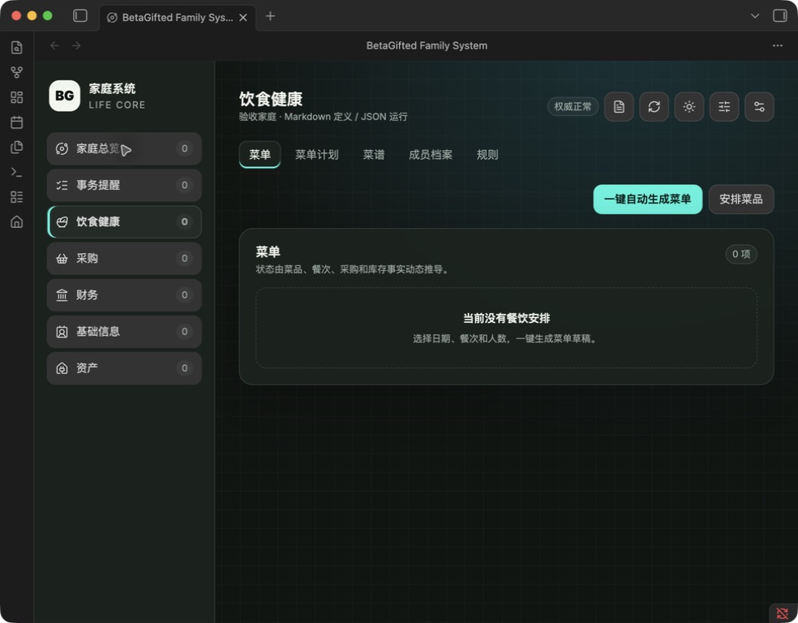

# Current-stable Obsidian acceptance

Date: 2026-08-29

Environment: Obsidian 1.13.7 on macOS, using a newly created de-identified isolated Vault. The installed app shell metadata was not treated as evidence for Obsidian 1.8.10.

Verified:

- manual community-plugin enable and first-use wizard display;
- local-only privacy notice and backup-boundary acknowledgement;
- family name `验收家庭`, default authority root `家庭管理系统`, and default Life Core root;
- Apple integration remained disabled;
- `family-system/store-v4` manifest and domain-partitioned authority map;
- six generated Markdown authority modules;
- exactly one household and three task categories: `家庭采购`, `食材处理`, `家庭事务`;
- no simulated member, menu, recipe, finance, inventory, purchase, receipt, or task records;
- application-window reload preserved data, did not repeat onboarding, and reported authority as healthy;
- core dashboard remained usable without the Apple companion.

Evidence screenshot:

Not verified by this run:

- Obsidian 1.8.10 core acceptance;
- a reliable manual light-mode screenshot;
- physical iPhone, offline-recovery, or seven-day soak evidence.

These remaining items continue to block the stable 2.3.0 Release and Community submission.
